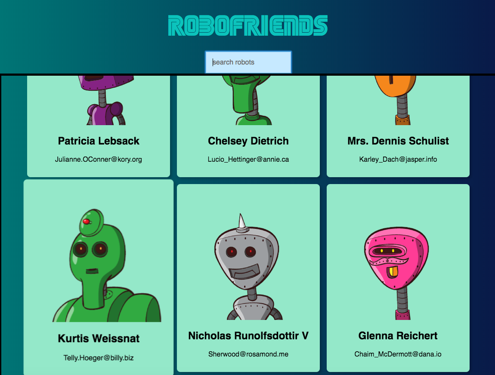
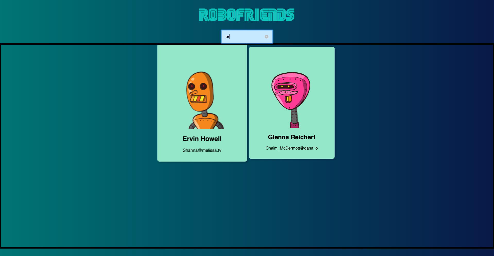

# Robofriends
A responsive web application to search for robot friends among all.

This project was created with HTML5, CSS3, JavaScript, React, tachyons, robohash API and jsonplaceholder API.

You can view a live demo [here](https://jiaxuanc.github.io/robofriends).

## Table of Contents

- [Folder Structure](#folder-structure)
- [Instructions](#instructions)
- [Screenshots](#screenshots)

## Folder Structure

```
robofriends
├── README.md
├── .gitignore
├── package.json
├── package-lock.json
├── public
│   ├── index.html
│   ├── favicon.ico
│   ├── manifest.json
└── src
    ├── index.css
    ├── index.js
    ├── registerServiceWorker.js
    ├── containers
    │   ├── App.css
    │   ├── App.js
    │   └── SEGA.woff
    └── components
        ├── Card.js
        ├── CardList.js
        ├── Scroll.js
        └── SearchBox.js
```

## Instructions
To run this app in local environment, in the project directory
  - first run `npm install` to install the dependencies
  - then run `npm start`
  - Open [http://localhost:3000](http://localhost:3000) to view it in the browser.

## Screenshots
<p align='center'>
  <br>
  <br>
  <br>
</p>

